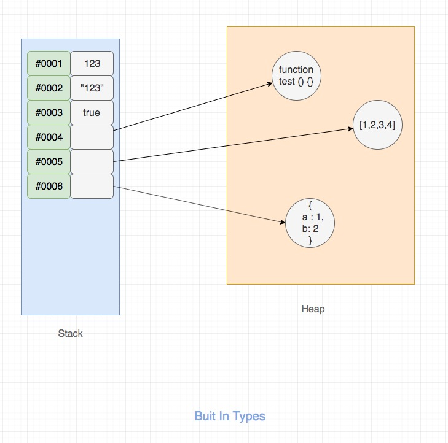

## 概述

`ECMAScript` 规范规定语言类型有六种 `Underfined` , `Null` , `Boolean` , `String` , `Number` 和 `Object` , `ES6` 又添加了一种基本类型 `Symbol`.

其中 `Object` 是引用类型, 其他是基本类型. 他们的划分方式其实是其是否可以表示为固定长度， 比如`Undefined`，`Null`，`Boolean`，`String`，`Number` 这些可以有固定长度，因此是基本类型，并且保存到了栈上。 Object 由于不可预知长度，并且可以 mutate，因此算引用类型，会被分配到了另一块区域，我们称之为堆（heap）.

:::tip
字符串是不可变的，因此被认为有固定长度。
:::



其实类型指的是值的类型，不是变量的类型，这是动态语言和静态语言的差异。 对于静态语言来说，我们可以限定一个变量的类型。但是对于 JS 这种动态类型的语言来说， 我们无法给变量限定类型，变量的类型是可变的。举个例子：

```js
var a = 1;
typeof a; // "number"

a = {};
typeof a; // "object"
```

## [typeof](https://developer.mozilla.org/zh-CN/docs/Web/JavaScript/Reference/Operators/typeof)

| 类型                                            |      结果      |
| ----------------------------------------------- | :------------: |
| Undefined                                       |  "undefined"   |
| Null                                            |    "object"    |
| Boolean                                         |   "boolean"    |
| Number                                          |    "number"    |
| BigInt                                          |    "bigint"    |
| String                                          |    "string"    |
| Symbol (ECMAScript 2015 新增)                   |    "symbol"    |
| 宿主对象（由 JS 环境提供）                      | 取决于具体实现 |
| Function 对象 (按照 ECMA-262 规范实现 [[Call]]) |   "function"   |
| 其他任何对象                                    |    "object"    |

- `typeof` null

```js
// JavaScript 诞生以来便如此
typeof null === 'object';
```

在 JavaScript 最初的实现中，JavaScript 中的值是由一个表示类型的标签和实际数据值表示的。对象的类型标签是 0。由于 null 代表的是空指针（大多数平台下值为 0x00），因此，null 的类型标签是 0，typeof null 也因此返回 "object"。（参考来源）

曾有一个 ECMAScript 的修复提案（通过选择性加入的方式），但被拒绝了。该提案会导致 typeof null === 'null'。

-- 使用 `new` 操作符

```js
// 除 Function 外的所有构造函数的类型都是 'object'
var str = new String('String');
var num = new Number(100);

typeof str; // 返回 'object'
typeof num; // 返回 'object'

var func = new Function();

typeof func; // 返回 'function'
```

## [Number](https://developer.mozilla.org/zh-CN/docs/Web/JavaScript/Reference/Global_Objects/Number)

```js
0.1 + 0.2 === 0.3; // false
```

JavaScript 的 Number 对象是经过封装的能让你处理数字值的对象。Number 对象由 Number() 构造器创建。

JavaScript的Number类型为双精度IEEE 754 64位浮点类型。

最近出了stage3BigInt 任意精度数字类型，已经进入stage3规范

- Number.EPSILON 

Number.EPSILON 属性表示 1 与Number可表示的大于 1 的最小的浮点数之间的差值。

你不必创建一个 Number 对象来访问这个静态属性（直接使用 Number.EPSILON）。

function numbersCloseEnoughToEqual(n1,n2) {
    return Math.abs( n1 - n2 ) < Number.EPSILON;
}

var a = 0.1 + 0.2;
var b = 0.3;

numbersCloseEnoughToEqual( a, b );                    // true
numbersCloseEnoughToEqual( 0.0000001, 0.0000002 );    // false
